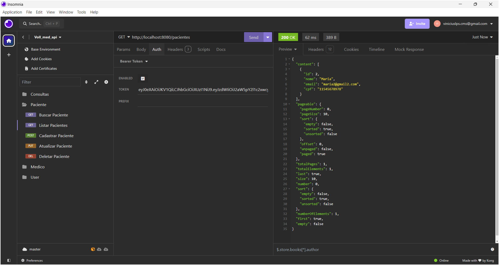
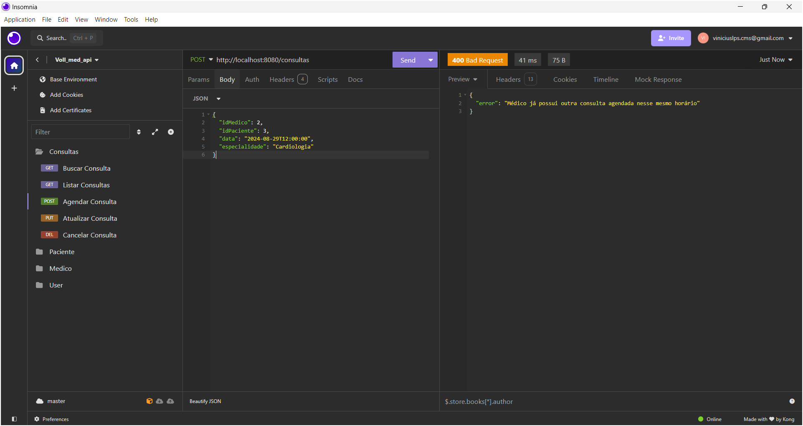

# VollMed API 

A VollMed API é uma aplicação desenvolvida em Java com Spring Framework, 
destinada à gestão de uma clínica médica. Com recursos de autenticação JWT, 
a API permite o cadastro de médicos, pacientes e consultas, fornecendo 
endpoints públicos para login e cadastro de usuários.

Foi implementado um workflow de Integração Contínua (CI) utilizando GitHub Actions 
para testes e builds em pull requests, e um processo de Entrega Contínua (CD) que 
realiza o deploy automático da aplicação em produção. A aplicação é containerizada 
com Docker e implantada na Azure, garantindo atualizações rápidas e escalabilidade.

[Vollmed API Azure](https://vollmed-api-hza2gbbsedfchrer.eastus2-01.azurewebsites.net/swagger-ui/index.html)

---

## Requisitos:
- Ter o Docker instalado.
- Ter o Java instalado.
- Ter um banco de dados PostgreSQL.
- Clonar este repositório: `git clone https://github.com/viniciusleonel/vollmed-api`

## Configuração

1. Configure as variáveis de ambiente no seu arquivo `.env` ou no seu ambiente:
- POSTGRES_DB_URL
- POSTGRES_DB_TEST_URL
- JWT_SECRET
- PROFILE

2. Agora execute a classe `VollMedApplication` e a API estará pronta para uso.

## Executando o Projeto com Docker

1. Configure as mesmas variáveis de ambiente em `docker-compose`>`environment`

2. Abra o terminal na pasta raiz que contém os arquivos docker e digite os seguintes comandos:

   - Construir a imagem:
     `docker-compose build`

   - Iniciar os contêineres:
     `docker-compose up -d`

    Isso irá iniciar o contêiner em segundo plano.

Feito isso, a API estará disponível em `http://localhost:8080`.

## Como Utilizar

- Cadastre-se como um usuário fazendo uma requisição POST para `/usuarios`.
- Para autenticar-se na API e obter um token JWT, faça uma requisição POST para `/login` enviando as credenciais de usuário.
- Utilize o token JWT recebido nas requisições aos endpoints privados da API, enviando-o no cabeçalho `Authorization`.

## Recursos e Funcionalidades

- **Cadastro de Usuários**: A API oferece a funcionalidade de cadastro de novos usuários, que será o responsável por gerenciar a clínica. O endpoint `/usuarios` permite o registro de novos usuários.
- **Autenticação JWT**: A API utiliza JSON Web Tokens (JWT) para autenticação de usuários. O endpoint `/login` é público e permite que os usuários obtenham um token JWT válido para as próximas requisições.
- **Gerenciamento de Médicos**: Os médicos podem ser gerenciados na API através do endpoint `/medicos`.
- **Gerenciamento de Pacientes**: Os pacientes podem ser gerenciados na API através do endpoint `/pacientes`.
- **Gerenciamento de Consultas**: Os usuários podem gerenciar consultas utilizando o endpoint `/consultas`.

## Endpoints Públicos

- **POST /usuarios/cadastrar**: Endpoint para cadastro de novos usuários. Recebe os dados do usuário a ser cadastrado.
- **POST /login**: Endpoint para autenticação de usuários. Recebe as credenciais do usuário e retorna um token JWT válido.

### Cadastro/Login Usuario POST
- **login***: string ( email )
- **senha***: string

## Endpoints Privados

### Cadastro Endereço
- **logradouro***: string
- **bairro***: string
- **cep***: string  
  pattern: \d{8}
- **cidade***: string
- **uf***: string
- **numero***: string
- **complemento**: string

    ### Parâmetros de Paginação e Ordenação
  /pacientes?page=0&size=1&sort=nome
- **page**: integer  
  minimum: 0
- **size**: integer  
  minimum: 1
- **sort**: [string]

### Pacientes

- **GET /pacientes**: Lista todos os pacientes cadastrados com paginação.
- **GET /pacientes/{id}**: Retorna os detalhes de um paciente específico.
- **DELETE /pacientes/{id}**: Remove um paciente existente.
- **POST /pacientes**: Cadastra um novo paciente.
- **PUT /pacientes/{id}**: Atualiza os dados de um paciente existente.

### Cadastro de Paciente POST
- **nome***: string
- **email***: string
- **telefone***: string  
  pattern: \(\d{2}\) \d{5}-\d{4} (xx) xxxxx-xxxx
- **cpf***: string  
  pattern: ^\d{11}$
- **endereco***: DadosEndereco{...}

### Atualização de Paciente PUT
- **nome**: string
- **telefone**: string  
  pattern: \(\d{2}\) \d{5}-\d{4} (xx) xxxxx-xxxx
- **endereco**: DadosEndereco{...}

Qualquer outro campo enviado retornará um erro.

### Médicos

- **GET /medicos**: Lista todos os médicos cadastrados com paginação.
- **GET /medicos/{id}**: Retorna os detalhes de um médico específico.
- **DELETE /medicos/{id}**: Remove um médico existente.
- **POST /medicos**: Cadastra um novo médico.
- **PUT /medicos/{id}**: Atualiza os dados de um médico existente.

### Cadastro de Médico POST
- **nome***: string
- **email***: string
- **telefone***: string  
  pattern: \(\d{2}\) \d{5}-\d{4}
- **crm***: string  
  pattern: \d{4,6}
- **especialidade***: string  
  Enum: [ Ortopedia, Cardiologia, Ginecologia, Dermatologia, Odontologia ]
- **endereco***: DadosEndereco{...}

### Atualização de Médico PUT
- **nome**: string
- **telefone**: string  
  pattern: \(\d{2}\) \d{5}-\d{4}
- **endereco**: DadosEndereco{...}

Qualquer outro campo enviado retornará um erro.

### Consultas

- **POST /consultas**: Agenda uma nova consulta.
- **GET /consultas**: Lista todas as consultas agendadas com paginação.
- **GET /consultas/{id}**: Retorna os detalhes de uma consulta específica.
- **PUT /consultas/{id}**: Atualiza a data ou o status da consulta.
- **DELETE /consultas**: Remove uma consulta agendada.

[//]: # (- **PUT /consultas**: Atualiza os dados de uma consulta agendada.)

### Agendamento de Consulta POST
- **idMedico**: integer
- **idPaciente***: integer
- **data***: string($date-time)
- **especialidade***: string  
  Enum: [ Ortopedia, Cardiologia, Ginecologia, Dermatologia, Odontologia ]

Caso o ID do médico não seja informado, será selecionado um médico que estiver livre aleatóriamente.

### Atualizar Consulta PUT
- **data**: string($date-time)
- **status**: Enum: [ PACIENTE_DESISTIU, MEDICO_CANCELOU, CONSULTA_ATIVA, CONSULTA_EFETUADA, OUTROS ]

### Cancelar Consulta DELETE
- **idConsulta***: integer
- **motivo***: string  
  Enum: [ PACIENTE_DESISTIU, MEDICO_CANCELOU, CONSULTA_ATIVA, OUTROS ]

## Tecnologias Utilizadas

- Java
- Spring Boot
- Spring Security
- Spring Doc
- Json Web Token (JWT)
- Auth0
- Hibernate (JPA)
- Swagger
- PostgreSQL
- Docker & DockerHub
- GitHub Actions
- Microsoft Azure

## **Criado por**: [Vinicius Leonel](https://www.linkedin.com/in/viniciuslps/)

## Imagens da API

## Swagger

## Cadastro de Usuário - Post

## Cadastro de Usuário - Post (Tratamento de Erro - Campos Inválidos)

## Cadastro de Usuário - Post (Tratamento de Erro - Usuário já Cadastrado)

## Login com retorno de um Json Web Token - Post

## Login - Post (Tratamento de Erro - Email Inválido)

## Login - Post (Tratamento de Erro - Credenciais Inválidas)

## Médico - Post 

## Médico - Post (Tratamento de Erro - Campos Inválidos)

## Médico - Post (Tratamento de Erro - Médico já Cadastrado)

## Médico - Get (Listagem de Médicos com paginação e filtros)

## Médico - Get (Buscar Médico por ID)

## Médico - Get (Tratamento de Erro - Médico não encontrado)

## Médico - Put (Atualizar Médico)

## Médico - Put (Tratamento de Erro - Campos Inválidos)

## Médico - Delete (Deletar Médico)

## Médico - Delete (Tratamento de Erro - Médico não encontrado)

## Paciente - Post 

## Paciente - Post (Tratamento de Erro - Campos Inválidos)

## Paciente - Post (Tratamento de Erro - Paciente já Cadastrado)

## Paciente - Get (Listagem de Pacientes com paginação e filtros)

## Paciente - Get (Buscar Paciente por ID)

## Paciente - Get (Tratamento de Erro - Paciente não encontrado)

## Paciente - Put (Atualizar Paciente)

## Paciente - Put (Tratamento de Erro - Campos Inválidos)

## Paciente - Delete (Deletar Paciente)

## Paciente - Delete (Tratamento de Erro - Paciente não encontrado)

## Consulta - Post (Agendar Consulta)

## Consulta - Post (Agendar Consulta - Tratamento de Erro - Médico ocupado)

## Consulta - Post (Agendar Consulta - Tratamento de Erro - Paciente só pode ter uma consulta por dia)

## Consulta - Post (Agendar Consulta - Tratamento de Erro - Paciente excluído)

## Consulta - Post (Agendar Consulta - Tratamento de Erro - Médico excluído)

## Consulta - Post (Agendar Consulta - Tratamento de Erro - Data inválida)

## Consulta - Get (Listagem Consultas com paginação e filtros)

## Consulta - Get (Buscar Consulta por ID)

## Consulta - Get (Buscar Consulta - Tratamento de Erro - Consulta não encontrada)

## Consulta - Put (Atualizar Consulta)

## Consulta - Delete (Cancelar Consulta)

